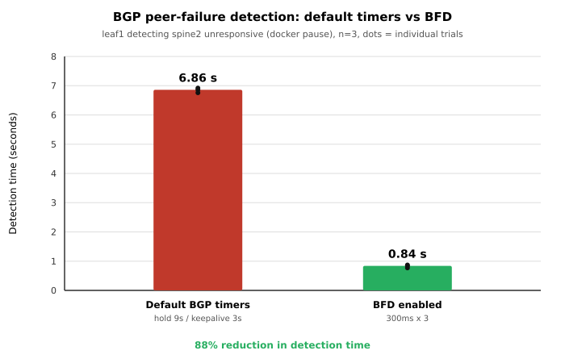

# Convergence Measurement - BGP Detection Time, Default Timers vs BFD

## What this shows
How long leaf1 takes to detect that spine2 has stopped responding, with default BGP
timers and with BFD. Detection is the quantity BFD changes - it does not alter route
propagation, and it does not supply the backup path (ECMP installed that beforehand).

## Result

| Configuration                        | Trials (s)         | Median  |
|--------------------------------------|--------------------|---------|
| Default BGP timers (hold 9s / KA 3s) | 6.76, 6.92, 6.86   | 6.86 s  |
| BFD enabled (300ms x 3)              | 0.84, 0.77, 0.87   | 0.84 s  |

**88% reduction in detection time.**



## Method
`docker pause` on spine2: the peer stops responding while its interfaces stay up -
the exact case hold timers cover. Downing an interface instead would trigger immediate
local link detection and never exercise the timer.

leaf1's peer state is polled every 50ms via `show bgp summary json`. Detection time is
injection until the peer leaves Established. Three trials each, 15s apart.

## Why those numbers
Timers read from the router:

```
Hold time is 9, keepalive interval is 3 seconds
```

The hold timer restarts on each keepalive, so pausing mid-cycle lands detection between
6 and 9s. 6.86s is a hold-timer expiry.

```
peer 10.0.11.0 local-address 10.0.11.1 vrf default interface eth3
Detect-multiplier: 3
Receive interval: 300ms
Transmission interval: 300ms
```

300ms x 3 = a 900ms detection window; measured 0.84s sits just inside it.

BFD was enabled with `neighbor <ip> bfd` on all four nodes and verified up before
measuring:

```
Session count: 2
SessionId  LocalAddress    PeerAddress    Status
1322543997 10.0.1.1        10.0.1.0       up
3177160032 10.0.11.1       10.0.11.0      up
```

## Limitations
Proven: BFD cuts the time BGP takes to notice an unresponsive peer by 88% under
identical conditions. Not proven: end-to-end data-plane outage - detection is one
component of convergence, and propagation and FIB update follow it.

## Open item - data-plane outage
A separate test (h1 to h2, 10ms probes, leaf1's uplink to spine2 downed) showed a
16.3-16.4s gap across all three trials, beginning at failure and ending ~1.3s *after*
the link was restored 15s later. Traffic never failed over to the surviving spine
despite ECMP having both next-hops installed. Longer than detection explains;
unresolved. Two candidates, not yet distinguished:

1. Return path - the reverse flow hashes independently at leaf2 and may have been
   pinned to spine2, making recovery depend on spine2 withdrawing rather than on
   leaf1's local reconvergence.
2. Nexthop retention - the kernel may keep using a next-hop whose link is down until
   zebra removes it (`ignore_routes_with_linkdown`).

The detection measurement is unaffected either way: it observes BGP state on leaf1
directly, not end-to-end traffic.

## Method notes
Two instrument corrections, both caught by checking *when* the worst gap occurred
rather than only its size.

**Probe overhead exceeded the signal.** Spawning `docker exec ping -c 1` per probe cost
30-80ms irregularly - a ~90ms noise floor, confirmed by trials whose largest gap was
timestamped *before* injection. An earlier 63ms reading was therefore indistinguishable
from noise. Replaced with one long-lived `ping -D -i 0.01` inside the container.

**The failure was injected on a path the traffic never used.** Pausing spine1 produced
no outage at all. Linux's default multipath hash is L3-only (src/dst IP) and ICMP has
no ports, so every probe hashed identically and pinned to one uplink. tcpdump confirmed
it: eth3 carried all probe traffic, eth1 none. Failing a path a flow doesn't traverse
can't measure that flow's convergence - the same reason a degraded ECMP member is
invisible to a single-flow health check.

## Files
`tests/detection.py` (detection time) · `tests/convergence.py` (data-plane, see open
item) · `tests/plot_convergence.py` · `docs/convergence-detection.svg`

## Commands used

```
python3 tests/detection.py                     # baseline

for f in configs/*/frr.conf; do
  sed -i -E 's/^( neighbor ([0-9.]+) remote-as [0-9]+)$/\1\n neighbor \2 bfd/' $f
done
sudo containerlab deploy -t topology.clab.yml --reconfigure
docker exec clab-p1-mini-leaf1 vtysh -c "show bfd peers brief"

python3 tests/detection.py                     # with BFD
python3 tests/plot_convergence.py
```
